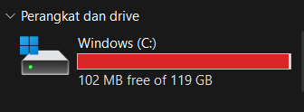

## Reflection 1
1. Compare the application logs before and after you exposed it as a Service. <br>
Try to open the app several times while the proxy into the Service is running. <br>
What do you see in the logs? Does the number of logs increase each time you open the app?<br>

Tampilan log sebelum service di-expose<br>
```
D:\minikube>kubectl logs hello-node-55fdcd95bf-2cwjk
I0516 14:25:19.728813       1 log.go:195] Started HTTP server on port 8080
I0516 14:25:19.730226       1 log.go:195] Started UDP server on port  8081
```
<br>
Tampilan log setelah aplikasi dijalankan sekali

```
I0516 14:25:19.728813       1 log.go:195] Started HTTP server on port 8080
I0516 14:25:19.730226       1 log.go:195] Started UDP server on port  8081
I0516 14:59:41.176120       1 log.go:195] GET /
I0516 14:59:41.252244       1 log.go:195] GET /
```

<br>
Tampilan log setelah aplikasi dijalankan dua kali

```
I0516 14:25:19.728813       1 log.go:195] Started HTTP server on port 8080
I0516 14:25:19.730226       1 log.go:195] Started UDP server on port  8081
I0516 14:59:41.176120       1 log.go:195] GET /
I0516 14:59:41.252244       1 log.go:195] GET /
I0516 15:01:15.364665       1 log.go:195] GET /
I0516 15:01:15.486157       1 log.go:195] GET /
```
<br>
Iya, jumlah log meningkat setiap aplikasi dibuka/dijalankan. Log merupakan catatan dari aktivitas yang terjadi dalam sebuah kontainer pada suatu waktu tertentu. Service yang telah di-expose dapat menerima request. Oleh karena itu log akan mencatat request-request yang dibuat setelah service di-expose.
<br>
<br>

2.  Notice that there are two versions of `kubectl get` invocation during this tutorial section.<br>
The first does not have any option, while the latter has `-n` option with value set to `kube-system`. <br>
What is the purpose of the `-n` option and why did the output not list the pods/services that you explicitly created? <br>
Jawab: <br>
Opsi '-n' pada `kubectl get` digunakan untuk merinci namespace dari resource Kubernetes yang ingin didapatkan/dilist. Saat kita menjalankan `kubectl get pods`, hasilnya adalah list semua pod di `default` namespace. Sedangkan pada `kubectl get pods -n kube-system`, kita secara eksplisit merujuk ke namespace `kube-system`, sehingga hasilnya hanya list pod pada namespace `kube-system` saja. Alasan kenapa output `kubectl get pods -n kube-system` tidak menunjukkan service `hello-node` yang telah dibuat sebelumnya adalah karena kita meng-expose service tersebut di namespace `default`, bukan di `kube-system`. 

## Reflection 2
1. What is the difference between Rolling Update and Recreate deployment strategy?
<br>
Rolling update adalah strategi deployment di mana versi baru dari suatu deployment secara bertahap diperkenalkan, sedangkan versi lamanya secara bertahap akan diakhiri. Strategi ini memastikan tidak ada down time selama proses pembaruan karena versi barunya diimplementasikan secara bertahap. Sedangkan recreate adalah strategi deployment di mana versi lama dari suatu aplikasi benar-benar diakhiri sebelum versi barunya diperkenalkan. Akibatnya terdapat down time selama proses pembaruan untuk menunggu versi lama selesai diakhiri dan versi baru selesai diimplementasikan. Secara umum, strategi Recreate lebih sederhana dan dapat diprediksi karena proses termination versi lama dan creation versi barunya lebih straight-forward. Namun seperti yang sudah dijelaskan sebelumnya, kekurangan strategi recreate adalah cost of downtime. 

2. Try deploying the Spring Petclinic REST using Recreate deployment strategy and document your attempt.
3. Prepare different manifest files for executing Recreate deployment strategy.

<br>
Penyimpanan saya terlalu penuh sehingga docker desktop tidak dapat dijalankan. Akibatnya minikube juga tidak dapat dijalankan 
Namun idenya adalah melakukan deploy ulang, meng-expose servicenya, dan mengganti type pada strategy menjadi Recreate. 
<br>

4. What do you think are the benefits of using Kubernetes manifest files? Recall your experience
in deploying the app manually and compare it to your experience when deploying the same app
by applying the manifest files (i.e., invoking `kubectl apply -f` command) to the cluster.
<br>
Menurut saya deploy menggunakan Kubernetes manifest files lebih praktis dan minim error selama prosesnya asalkan isi filenya sudah benar. Saat melakukan deploy secara manual, seringkali terjadi salah ketik atau salah copy yang mengakibatkan prosesnya tidak berjalan lancar. Apalagi dengan penyimpanan saya yang terbatas, menjalankan Docker dan Minikube terlalu lama biasanya menimbulkan masalah sehingga saya harus membuat ulang container minikubenya. Proses ini berjalan lama dan berulang terus-menerus. Dengan menggunakan manifest file, proses deploy bisa berjalan jauh lebih cepat. 